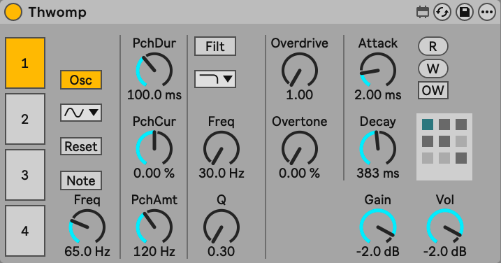

# Thwomp

Drum synthesizer.

## Description

Thwomp is a four oscillator drum synthesizer for [Max for Live](https://www.ableton.com/en/live/max-for-live/).

## Interface

- Gain: Gain is on the far right
- Oscillator Tabs: The four tabs on the left select an oscillator, all of the following settings (excluding presets) are per oscillator

### Oscillator Section

- `osc` Toggle: Toggle the entire oscillator
- `note` Toggle: Toggle whether to use the incoming MIDI note frequency (when off, the frequency is specified)
- `Hz`: When `note` is off, specify a frequency
- `Semi`: When `note` is on, specify an offset
- Oscillator Type
- `ms`: Attack
- `ms`: Decay

### Pitch Envelope Section

- Pitch Envelope Graph
- `Hz`: Pitch envelope amount
- `ms`: Pitch envelope decay

### Preset Section

- `r`: Read presets from a file
- `w`: Write the presets to a file
- Preset Toggle: When toggled on, `w` will write again to the same filename without prompting.
- To recall a preset, click a box
- To save a preset, shift-click a box
- To delete a preset, option-click a box

### Filter Section

- Filter Toggle: Turn on or off the filter
- Filter Type
- `Hz`: Filter cutoff
- `dB`: Filter gain
- `Q`: Filter Q

### Standalone Controls

When Thwomp is loaded outside of Ableton Live, it offers some additional features.

- **Note Selection** & **Button** (Far left): Click the button to trigger the selected note.
- `s`: Typing this key will also play the note
- Speaker Toggle: Toggles whether the audio engine is on

## Presets

The following presets are built-in, they're numbered from the upper left to the lower right (so the upper right preset is the kick).

### 1. Kick

#### Oscillator 1 (Body)

- `65Hz`
- `Cycle`
- `2ms` Attack
- `383ms` Decay
- `122` Gain

##### Pitch Envelope

- `120Hz` Amount
- `100ms` Decay

#### Oscillator 2 (Transient/Click)

- `251Hz`
- `Rect`
- `0ms` Attack
- `26ms` Decay
- `122` Gain

##### Filter

- `bandpass`
- `500Hz`
- `9.1dB`
- `5.6Q`

### 2. Snare

#### Oscillator 1 (Body)

- `175Hz`
- `Cycle`
- `1ms` Attack
- `60ms` Decay
- `122` Gain

##### Filter

- `highpass`
- `40hz`
- `0dB`
- `0.66Q`

#### Oscillator 2 (Noise)

- `Noise`
- `0ms` Attack
- `76ms` Decay
- `90` Gain

##### Filter

- `highpass`
- `1447hz`
- `0dB`
- `1.4Q`

### 3. Tom

#### Oscillator 1 (Body)

- `110Hz`
- `Cycle`
- `2ms` Attack
- `500ms` Decay
- `122` Gain

##### Pitch Envelope

- `12Hz` Amount
- `300ms` Decay

##### Filter

- `highpass`
- `50hz`
- `0dB`
- `0.3Q`

#### Oscillator 2 (Noise)

- `Pink`
- `2ms` Attack
- `200ms` Decay
- `90` Gain

##### Filter

- `lowpass`
- `1200hz`
- `0dB`
- `0.3Q`

### 4. Hi-Hat

#### Oscillator 1 (Noise)

- `Noise`
- `0ms` Attack
- `150ms` Decay
- `97` Gain

#### Filter

- `highpass`
- `6000Hz`
- `0dB`
- `0.3Q`

### 5. Bongo

#### Oscillator 1 (Pitch 1)

- `1100Hz`
- `Saw`
- `0ms` Attack
- `125ms` Decay
- `72` Gain

#### Filter

- `lowpass`
- `1100Hz`
- `0dB`
- `3Q`

#### Oscillator 2 (Pitch 2)

- `725Hz`
- `Cycle`
- `0ms` Attack
- `125ms` Decay
- `88` Gain

#### Filter

- `lowpass`
- `8000Hz`
- `0dB`
- `0.3Q`

#### Oscillator 3 (Noise)

- `Pink`
- `0ms` Attack
- `200ms` Decay
- `82` Gain

#### Filter

- `lowpass`
- `12000Hz`
- `0dB`
- `0.3Q`
