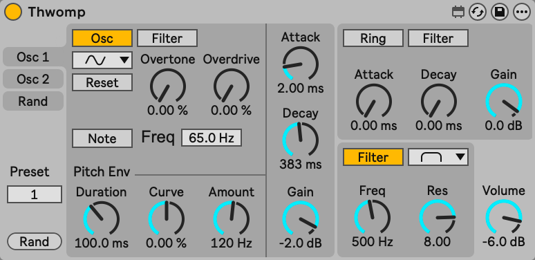
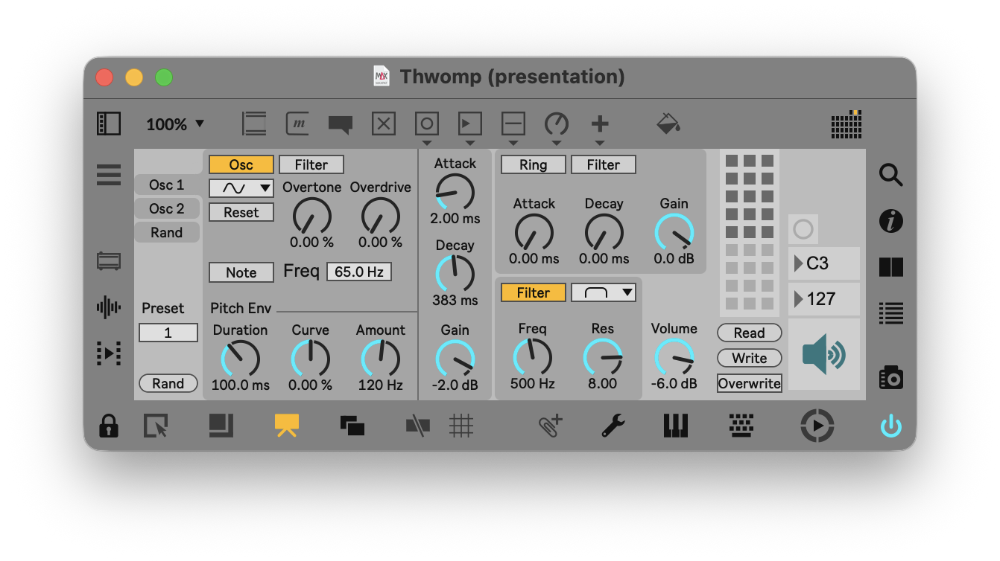
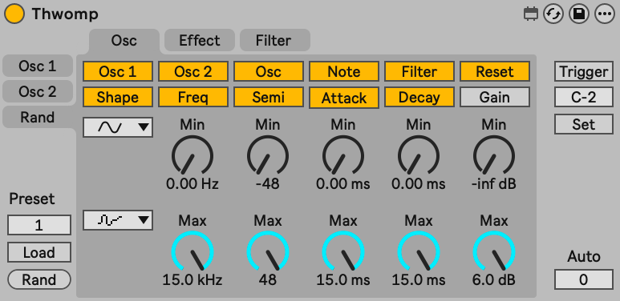
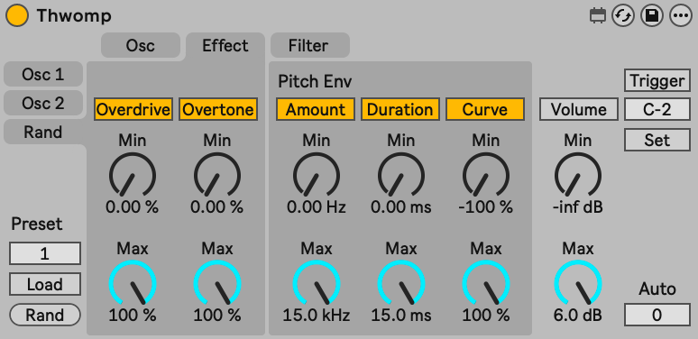
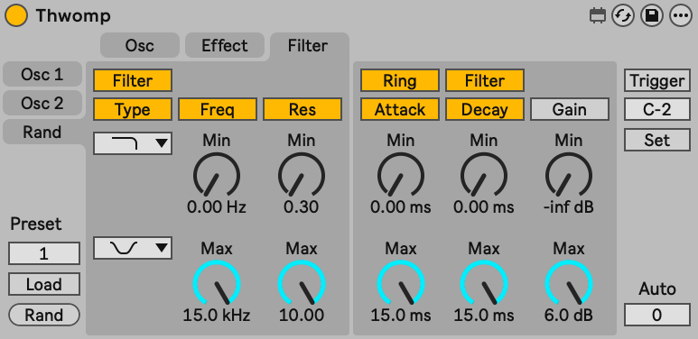

# Thwomp

Thwomp is a four oscillator drum synthesizer for [Max for Live](https://www.ableton.com/en/live/max-for-live/). It's a [subtractive synthesizer](https://en.wikipedia.org/wiki/Subtractive_synthesis) that specializes in making drum sounds with the following features:

- Fixed frequency by default, as most drum sounds aren't played chromatically.
- Prominent pitch envelope for creating kick drums.
- No sustain or release, because those aren't features of percussive instruments.

Thwomp's interface is designed to be transparent and predictable, e.g., every parameter is labeled with its [unit type](https://en.wikipedia.org/wiki/Unit_of_measurement).

## Installation

### Freezing the `.amxd`

Before the device is added to the `User Library` in Ableton Live or Ableton Push, the device should be frozen.

The latest version of the frozen device can be downloaded from [the Thwomp page on the Max for Live site](https://maxforlive.com/library/device/5793/thwomp).

The device can be frozen manually by following these steps:

1. Open Ableton Live and drag `Thwomp/Thwomp.amxd` to the Device area (where it says `Drop an instrument or Sample here`).
2. Click the disclosure icon in the upper right of the device and choose `Edit in Max`.
3. In the Max window, click the `Freeze Device` icon in the bottom bar that looks like a snow flake, then choose `File > Save As...` to save the frozen device to a temporary location.

Note that this file can be deleted after the device has been added to the `User Library`.

### Installing in Ableton Live

Drag the frozen `Thwomp.amxd` to the `User Library` (e.g., under `User Library/Presets/Instruments/Max Instrument/`).

### Installing in Ableton Push Standalone Mode

1. Launch Push in standalone mode
2. In Live's sidebar, select `Places > Push`
3. Drag the frozen `Thwomp.amxd` to `Places > Push > User Library` (e.g., under `User Library/Presets/Instruments/Max Instrument/` [note that in the Push Use Library this folder is *not* create by default like it is in the Live User Library]).

### Using the Device on Push

After Thwomp has been installed in the Push `User Library`, the device can be added by choosing it under `Device > User Library`.

## Opening in Max Directly

To open in Max directly without Live, open `Thwomp/Thwomp.maxpat`, Thwomp has some some additional features when opened outside of Live:

- **Button**: Trigger the MIDI note
- **Pitch**: Select the MIDI note pitch
- **Velocity**: Select the MIDI note velocity
- DAC Toggle: Toggles whether the audio engine is on
- Typing the letter "s" plays the note

## Presets

Presets are available either when opening in Max directly, or by choosing `Edit in Max` in Live (and dragging the Max window size larger to expose the preset controls).

- **Read**: Read presets from a file
- **Write**: Write the presets to a file
- **Overwrite**: When toggled on, **Write** will automatically write again to the sample file
- To recall a preset, click a box
- To save a preset, shift-click a box
- To delete a preset, shift-option-click a box

## Parameter Reference

### Global

- **Volume:** Device volume
- **Osc 1-2:** Display oscillator controls
- **Load:** Toggle whether to load the selected preset
- **Preset:** Choose the selected preset
- **Rand:** Randomize

### Oscillator

- **Osc:** Toggle the oscillator on or off
- **Shape:** The waveform of the oscillator
- **Reset:** Toggle resetting the oscillator phase on each new note
- **Note:** Toggle whether to use the incoming MIDI note frequency (when off, the frequency is specified by the **Freq** control)
- **Freq:** Specify a frequency (only visible when **Note** is off)
- **Semi:** Specify a semitone offset (only visible when **Note** is on)
- **Filter:** Toggle whether the oscillator is routed through the filer
- **Overdrive:** Overdrive distortion
- **Overtone:** Overtone harmonics

### Pitch Envelope

- **Duration:** Pitch envelope duration
- **Curve:**: Pitch envelope curve
- **Amount:** Pitch envelope amount

### Filter

- **Filter:** Toggle the filter on or off
- **Type:** The type of the filter
- **Freq**: The filter cutoff
- **Res**: The filter resonance

### Envelope

- **Attack**: The envelope attack
- **Decay**: The envelope decay
- **Gain**: The gain of this oscillator

## Randomize

### Oscillator

#### Toggles

- **Osc 1:** Toggle whether to randomize **Osc 1**
- **Osc 2:** Toggle whether to randomize **Osc 2**
- **Osc:** Toggle whether to randomize **Osc**
- **Note:** Toggle whether to randomize **Note**
- **Filter:** Toggle whether to randomize **Filter**
- **Reset:** Toggle whether to randomize **Reset**
- **Shape:** Toggle and min-max range for **Shape**
- **Freq:** Toggle and min-max range for **Freq**
- **Semi:** Toggle and min-max range for **Semi**
- **Attack:** Toggle and min-max range for **Attack**
- **Decay:** Toggle and min-max range for **Decay**
- **Gain:** Toggle and min-max range for **Gain**

### Effect

- **Overdrive:** Toggle and min-max range for **Overdrive**
- **Overtone:** Toggle and min-max range for **Overtone**

#### Pitch Envelope

- **Amount:** Toggle and min-max range for **Amount**
- **Duration:** Toggle and min-max range for **Duration**
- **Curve:** Toggle and min-max range for **Curve**

### Filter

- **Filter:** Toggle whether to randomize **Filter**
- **Type:** Toggle and min-max range for **Type**
- **Freq:** Toggle and min-max range for **Freq**
- **Res:** Toggle and min-max range for **Res**

#### Ring

- **Ring:** Toggle whether to randomize **Ring**
- **Filter:** Toggle whether to randomize **Filter**
- **Attack:** Toggle and min-max range for **Attack**
- **Decay:** Toggle and min-max range for **Decay**
- **Gain:** Toggle and min-max range for **Gain**

## Ableton Push Support

Only controls are accessible on Push.

## Presets

1. Kick
2. 808 Kick
3. 909 Kick
4. Snare
5. Clap
6. Hi-Hat
7. Cymbal
8. Tom
9. Bell
10. Cowbell
11. Bongo Low
12. Bongo High
13. Conga Low
14. Conga High
15. Init

### 1. Kick

#### Oscillator 1 (Body)

- `65 Hz`
- `Sine`
- `2 ms` Attack
- `383 ms` Decay
- `-2 dB` Gain
- Filter off

##### Pitch Envelope

- `120 Hz` Amount
- `100 ms` Duration

#### Oscillator 2 (Click)

- `250 Hz`
- `Rect`
- `0 ms` Attack
- `26 ms` Decay
- `-8 dB` Gain
- Filter on

#### Filter

- `Bandpass`
- `500 Hz`
- `8` Res

### 2. 808 Kick

- `-6 dB` Volume

#### Oscillator 1 (Body)

- `Triangle`
- `48 Hz`
- `5%` Overtone
- `35%` Overdrive
- `2 ms` Attack
- `1000 ms` Decay
- `-2 dB` Gain

##### Pitch Envelope

- `100 ms` Duration
- `-30%` Curve
- `120 Hz` Amount

#### Oscillator 2 (Click)

- `Sine`
- `127 Hz`
- `1 ms`: Attack
- `35 ms`: Decay

### 3. 909 Kick

- `-2 dB` Volume

#### Oscillator 1 (Body)

- `Triangle`
- `50 Hz`
- `10%` Overtone
- `5%` Overdrive
- `2 ms` Attack
- `400 ms` Decay
- `-8 dB` Gain
- Filter on

##### Pitch Envelope

- `50 ms` Duration
- `160 Hz` Amount

#### Oscillator 2 (Click)

- `Sine`
- `127 Hz`
- `1 ms`: Attack
- `25 ms`: Decay
- Filter on

#### Filter

- `Lowpass`
- `1300 Hz`

### 4. Snare

#### Oscillator 1 (Body)

- `175 Hz`
- `Sine`
- `1 ms` Attack
- `60 ms` Decay
- `-8 dB` Gain
- Filter off

##### Pitch Envelope

- `200 Hz` Amount
- `3 ms` Duration

#### Oscillator 2 (Tail)

- `Noise`
- `2 ms` Attack
- `75 ms` Decay
- `-15 dB` Gain

#### Filter

- `Bandpass`
- `4500 Hz`
- `2` Res

### 5. Clap

#### Oscillator 1 (Body)

- `Noise`
- `0 ms` Attack
- `90 ms` Decay
- `0 dB` Gain
- Filter on
- `10%` Overdrive

#### Filter

- `Bandpass`
- `1200 Hz` Freq
- `2` Res

#### Oscillator 2 (Click)

- `1200 Hz`
- `Triangle`
- `0 ms` Attack
- `10 ms` Decay
- `-10 dB` Gain
- Filter off

##### Pitch Envelope

- `-2000 Hz` Amount
- `6 ms` Duration

### 6. Hi-Hat

#### Oscillator 1 (Body)

- `Noise`
- `0 ms` Attack
- `100 ms` Decay
- `-4 dB` Gain
- Filter on

#### Filter

- `Highpass`
- `6000 Hz`
- `0.3` Res

### 7. Cymbal

#### Oscillator 1 (Body)

- `Pink`
- `0 ms` Attack
- `550 ms` Decay
- `0 dB` Gain
- Filter on

#### Filter

- `Bandpass`
- `7000 Hz` Freq
- `4.5` Res

#### Oscillator 2 (Click)

- `13000 Hz`
- `Triangle`
- `100 ms` Decay
- `-20 dB` Gain
- Filter off
- `50%` Overdrive

##### Pitch Envelope

- `-2 Hz` Amount
- `6 ms` Duration

### 8. Tom

#### Oscillator 1 (Body)

- `110 Hz`
- `Sine`
- `2 ms` Attack
- `500 ms` Decay
- `-8 dB` Gain
- Filter off

##### Pitch Envelope

- `12 Hz` Amount
- `300 ms` Duration

#### Oscillator 2 (Tail)

- `Pink`
- `2 ms` Attack
- `200 ms` Decay
- `-18 dB` Gain
- Filter on

##### Filter

- `Lowpass`
- `1200 Hz`
- `0.3` Res

### 9. Bell

#### Oscillator 1 (Body)

- `Triangle`
- `1210 Hz`

##### Pitch Env

- `1.1 ms` duration
- `1210 Hz` amount

#### Oscillator 2 (Body)

- `Triangle`
- `2800 Hz`

#### Ring

- `300 ms` Decay

### 10. Cowbell

#### Oscillator 1 (Body)

- `Triangle`
- `700 Hz`

#### Oscillator 2 (Body)

- `Triangle`
- `1000 Hz`

#### Ring

- `1 ms` Attack
- `150 ms` Decay
### 11. Bongo Low

#### Oscillator 1 (Body)

- `375 Hz`
- `Sine`
- `2 ms` Attack
- `125 ms` Decay
- `-10 dB` Gain
- Filter off

##### Pitch Envelope

- `-200 Hz` Amount
- `2 ms` Duration

#### Oscillator 2 (Tail)

- `Pink`
- `0 ms` Attack
- `150 ms` Decay
- `-30 dB` Gain
- Filter off

### 12. Bongo High

#### Oscillator 1 (Body)

- `550 Hz`
- `Sine`
- `2 ms` Attack
- `125 ms` Decay
- `-10 dB` Gain
- Filter off

##### Pitch Envelope

- `-200 Hz` Amount
- `2 ms` Duration

#### Oscillator 2 (Tail)

- `Pink`
- `0 ms` Attack
- `150 ms` Decay
- `-30 dB` Gain
- Filter off

### 13. Conga Low

#### Oscillator 1 (Body)

- `200 Hz`
- `Sine`
- `2 ms` Attack
- `200 ms` Decay
- `-10 dB` Gain
- Filter off

##### Pitch Envelope

- `-200 Hz` Amount
- `2 ms` Duration

#### Oscillator 2 (Click)

- `100 Hz`
- `Triangle`
- `0 ms` Attack
- `90 ms` Decay
- `-20 dB` Gain
- Filter off

##### Pitch Envelope

- `1000 Hz` Amount
- `2 ms` Duration

### 14. Conga High

#### Oscillator 1 (Body)

- `425 Hz`
- `Sine`
- `2 ms` Attack
- `200 ms` Decay
- `-10 dB` Gain
- Filter off

##### Pitch Envelope

- `-200 Hz` Amount
- `2 ms` Duration

#### Oscillator 2 (Click)

- `300 Hz`
- `Triangle`
- `0 ms` Attack
- `70 ms` Decay
- `-20 dB` Gain
- Filter off

##### Pitch Envelope

- `1000 Hz` Amount
- `2 ms` Duration
