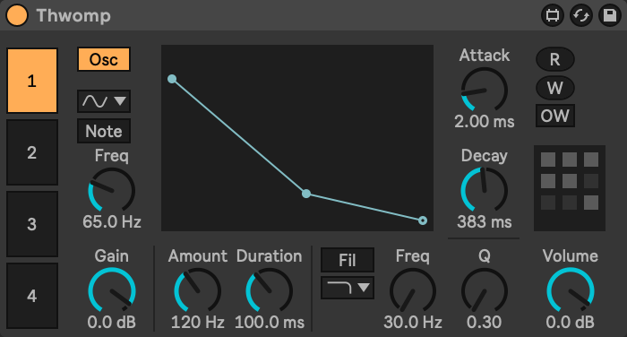

# Thwomp

Thwomp is a four oscillator drum synthesizer for [Max for Live](https://www.ableton.com/en/live/max-for-live/). It's a [subtractive synthesizer](https://en.wikipedia.org/wiki/Subtractive_synthesis) that specializes in making drum sounds with the following features:

- Fixed frequency by default, as most drum sounds aren't played chromatically.
- Prominent pitch envelope for creating kick drums.
- No sustain or release, because those aren't features of percussive instruments.

Thwomp's interface is designed to be transparent and predictable. Every parameter is labeled with its [unit type](https://en.wikipedia.org/wiki/Unit_of_measurement).

## Installation

Drag `max-for-live/instruments/Thwomp.amxd` to `User Library/Presets/Instruments/Max Instrument/`.

## Stand-Alone Mode

To open any of the `maxpat` files, the Sidewinder folder should be in your [Project Search Paths](https://docs.cycling74.com/max8/vignettes/projects_searchpath), `~/Documents/Max 8/Projects` by default, so that referenced files can be found.

Thwomp can also be opened in standalone mode by opening the `misc/instruments/Thwomp.maxpat`  outside of Ableton Live, it offers some additional features.

- **Button**: Trigger the MIDI note
- **Pitch**: Select the MIDI note pitch
- **Velocity**: Select the MIDI note velocity
- DAC Toggle: Toggles whether the audio engine is on
- Typing the `s` will play the note

## Global Parameters

- **Volume**: The volume of all of the oscillators combined.
- Oscillator Tabs 1-4: Select an oscillator

### Presets

- **R**: Read presets from a file
- **W**: Write the presets to a file
- **OW**: When toggled on, **W** will automatically write again to the sample file
- To recall a preset, click a box
- To save a preset, shift-click a box
- To delete a preset, shift-option-click a box

## Oscillator Parameters

### Waveform

- **Osc** Toggle: Toggle the oscillator on or off
- Waveform
- **Note** Toggle: Toggle whether to use the incoming MIDI note frequency (when off, the frequency is specified)
- **Freq**: Specify a frequency (only visible when **note** is off)
- **Semi**: Specify a semitone offset (only visible when **note** is on)

### Pitch Envelope

- Pitch Envelope Graph
- **Amount**: Pitch envelope amount
- **Duration**: Pitch envelope decay

### Filter

- Filter Toggle: Toggle the filter on or off
- Filter Type
- **Freq**: Filter cutoff
- **Q**: Filter Q

### Envelope

- **Attack**: Attack
- **Decay**: Decay

## Ableton Push

Thwomp support Ableton Push. When using Push, the leftmost knob always chooses the selected Oscillator. There's four different banks that allow all of Thwomp's parameters to be accessed.

### Banks

- Main
- Oscillator
- Envelope
- Filter

## Presets

The following presets are built-in, they're numbered from the upper left to the lower right (so the upper right preset is the kick).

### 1. Kick

#### Oscillator 1 (Body)

- `65Hz`
- `Cycle`
- `2ms` Attack
- `383ms` Decay
- `0db` Gain

##### Pitch Envelope

- `120Hz` Amount
- `100ms` Decay

#### Oscillator 2 (Transient/Click)

- `251Hz`
- `Rect`
- `0ms` Attack
- `26ms` Decay
- `-10db` Gain

##### Filter

- `bandpass`
- `500Hz`
- `5.6Q`

### 2. Snare

#### Oscillator 1 (Body)

- `175Hz`
- `Cycle`
- `1ms` Attack
- `60ms` Decay
- `0db` Gain

##### Filter

- `highpass`
- `40hz`
- `0.66Q`

#### Oscillator 2 (Noise)

- `Noise`
- `0ms` Attack
- `76ms` Decay
- `-14db` Gain

##### Filter

- `highpass`
- `1447hz`
- `1.4Q`

### 3. Tom

#### Oscillator 1 (Body)

- `110Hz`
- `Cycle`
- `2ms` Attack
- `500ms` Decay
- `0db` Gain

##### Pitch Envelope

- `12Hz` Amount
- `300ms` Decay

##### Filter

- `highpass`
- `50hz`
- `0.3Q`

#### Oscillator 2 (Noise)

- `Pink`
- `2ms` Attack
- `200ms` Decay
- `-14db` Gain

##### Filter

- `lowpass`
- `1200hz`
- `0.3Q`

### 4. Hi-Hat

#### Oscillator 1 (Noise)

- `Noise`
- `0ms` Attack
- `150ms` Decay
- `0db` Gain

#### Filter

- `highpass`
- `6000Hz`
- `0.3Q`

### 5. Bongo

#### Oscillator 1 (Pitch 1)

- `1100Hz`
- `Saw`
- `0ms` Attack
- `125ms` Decay
- `-20db` Gain

#### Filter

- `lowpass`
- `1100Hz`
- `3Q`

#### Oscillator 2 (Pitch 2)

- `725Hz`
- `Cycle`
- `0ms` Attack
- `125ms` Decay
- `-14db` Gain

#### Filter

- `lowpass`
- `8000Hz`
- `0.3Q`

#### Oscillator 3 (Noise)

- `Pink`
- `0ms` Attack
- `200ms` Decay
- `-14db` Gain

#### Filter

- `lowpass`
- `12000Hz`
- `0.3Q`
